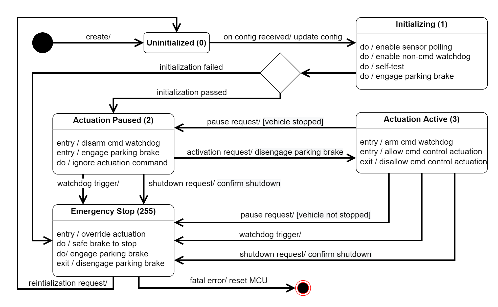

# Go Kart Controller - ROS2 Driver

## Purpose of Package

This packet is a ROS2 driver for Triton AI's go-kart real-time controller. The current development work targets ROS2 Galactic.

The packet is capable of sending control messages and receive sensor and state report from the controller.

## API

## Inner Working

## Known Issues
