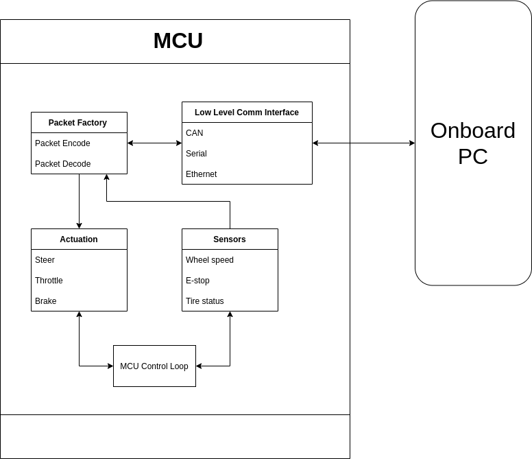

# Packet API

## Introduction

The transfer of messages through network interfaces of the team's choice (Serial, CAN, Ethernet) follows a standardized packet API for message serialization (encoding) and deserialization (decoding).

The low-level network interface (LLNI) of Serial, CAN and Ethernet is agnostic about what is being transferred. On top of that, the high-level network interface (HLNI), which is mainly the packet factory, is responsible for encoding and decoding between C++ class representation of message and low-level buffer to/from LLNI.

There are packet factories on both sides of the communication system, making it a reusable common library for both Go-Kart Controller (GKC) software and high-level softwares (ROS2).

## Packet Basics

Each packet is a variable buffer of bytes.

The Packet API takes substantial reference from VESC packet API.

A standard packet begins with byte 0x02, followed by 1 byte of payload length. Payload cannot exceed 256 bytes. After that, 2 bytes are used for payload checksum, and finnaly there is one termination byte 0x03.

Extended packet is not needed and not implemented for the moment, but any LLNI implementation should not rule out the possibility of such possibilities in the future.

## Base Payloads

These messages concerns the basic communication and device control, such as communication establishment, firmware version, MCU reset, heartbeat, and watchdog.

## Configuration Payloads

These messages set or get the configurations of the controller.

## Control Payloads

These messages commands the GKC to actuate its motors and servos.

## Feedback Payloads

These messages request or send GKC state, and sensor feedbacks.
